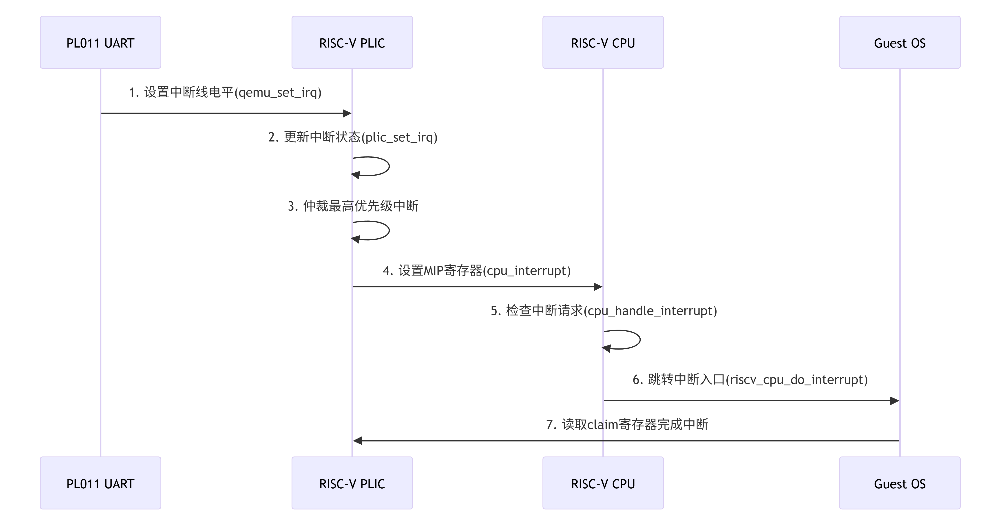

PL011 中断在 QEMU 中的全链路处理流程如下：



- 设备层：PL011 根据硬件状态触发中断信号
- 中断控制器层：PLIC 实现优先级仲裁和中断分发
- CPU 层：RISC-V 架构响应外部中断并切换上下文
- Guest 层：客户机程序或者操作系统中断处理程序完成设备服务

下面我们按照流程进行分析：

## PL011 触发中断

```c
// hw/char/pl011.c
static void pl011_update(PL011State *s) {
    uint32_t flags = s->int_level & s->int_enabled;
    qemu_set_irq(s->irq, flags != 0); // 关键中断触发
}
```

s->irq 连接到 PLIC 的特定中断线（如 UART0_IRQ=10），PLIC 再将中断路由到 CPU。

## PLIC 接收中断

PLIC 的 GPIO 输入处理函数更新中断状态：


```c
// hw/intc/sifive_plic.c
static void sifive_plic_set_irq(void *opaque, int irq, int level)
{
    SiFivePLICState *s = opaque;
    if (level) {
        s->pending[irq >> 5] |= 1 << (irq & 0x1F); // 设置 pending 位
    } else {
        s->pending[irq >> 5] &= ~(1 << (irq & 0x1F));
    }
    sifive_plic_update(s); // 触发更新
}
```

## PLIC 仲裁逻辑

在 sifive_plic_update() 中实现优先级仲裁：

```c
static void sifive_plic_update(SiFivePLICState *s)
{
    for (int i = 0; i < s->num_cpus; i++) {
        uint32_t max_prio = s->threshold[i];
        int max_irq = 0;
        
        // 遍历所有中断源
        for (int j = 0; j < s->num_sources; j++) {
            if (plic_irq_is_pending(s, j) && 
                plic_irq_is_enabled(s, i, j) &&
                s->source_priority[j] > max_prio) {
                max_prio = s->source_priority[j];
                max_irq = j;
            }
        }
        
        if (max_irq > 0) {
            s->claim[i] = max_irq; // 记录到 claim 寄存器
            qemu_set_irq(s->m_external_irqs[i], 1); // 触发 CPU 中断
        } else {
            qemu_set_irq(s->m_external_irqs[i], 0);
        }
    }
}
```

## CPU 中断注入

通过 cpu_interrupt 设置 CPU 中断请求标志：

```c
// include/hw/core/cpu.h
void cpu_interrupt(CPUState *cpu, int mask)
{
    cpu->interrupt_request |= mask;
    qatomic_set(&cpu_neg(cpu)->icount_decr.u16.high, -1);
}
```
- 设置 CPU_INTERRUPT_HARD 标志
- 修改 icount 强制退出当前 TB

## CPU 中断检查

在 vCPU 主循环中检测中断请求：


```c
// accel/tcg/cpu-exec.c
static inline bool cpu_handle_interrupt(CPUState *cpu,
                                       TranslationBlock **last_tb)
{
    if (unlikely(cpu_interrupt_request(cpu))) {
        if (cpu->interrupt_request & CPU_INTERRUPT_HARD) {
            cc->tcg_ops->do_interrupt(cpu); // 调用架构相关中断处理
            *last_tb = NULL;
            return true;
        }
    }
    return false;
}
```
## RISC-V 中断处理

riscv_cpu_do_interrupt 实现中断上下文切换：

```c
// target/riscv/cpu_helper.c
void riscv_cpu_do_interrupt(CPUState *cs)
{
    RISCVCPU *cpu = RISCV_CPU(cs);
    CPURISCVState *env = &cpu->env;
    
    // 1. 保存 PC 到 mepc
    env->mepc = env->pc;
    
    // 2. 设置中断原因
    env->mcause = MCAUSE_INTR | (IRQ_M_EXT << MCAUSE_CODE_SHIFT);
    
    // 3. 跳转到中断向量
    if (env->mtvec & MTVEC_MODE_MASK) {
        // 向量模式
        env->pc = (env->mtvec & ~MTVEC_MODE_MASK) + 4 * cause;
    } else {
        // 直接模式
        env->pc = env->mtvec & ~MTVEC_MODE_MASK;
    }
    
    // 4. 更新权限级别
    env->priv = PRV_M;
}
```

## Guest OS 中断处理

以 Linux 中断处理流程为例：

```c
// arch/riscv/kernel/entry.S
ENTRY(handle_arch_irq)
    SAVE_ALL
    csrr a0, mcause
    csrr a1, mepc
    mv a2, sp
    call riscv_intc_irq  // 跳转到 C 语言处理程序
    RESTORE_ALL
END(handle_arch_irq)

// drivers/irqchip/irq-sifive-plic.c
static void plic_irq_handler(struct irq_desc *desc)
{
    u32 hwirq = readl(plic->regs + PRIORITY_THRESHOLD);
    struct irq_chip *chip = irq_desc_get_chip(desc);
    
    chained_irq_enter(chip, desc);
    generic_handle_irq(irq_find_mapping(domain, hwirq));
    chained_irq_exit(chip, desc);
    
    // 完成中断处理
    writel(hwirq, plic->regs + INTERRUPT_COMPLETE);
}
```

## 调试与跟踪

开启 PLIC 调试：

```
qemu-system-riscv64 -d int,guest_errors -D plic.log
```

关键跟踪点 (trace-event)

```
qemu-system-riscv64 --trace "trace_sifive_plic_*"

// hw/intc/sifive_plic.c
trace_sifive_plic_set_irq(irq, level);
trace_sifive_plic_update(cpu_index, max_irq, max_prio);
```

后面 QEMU 调试章节，我们会详细介绍常用的调试手段。