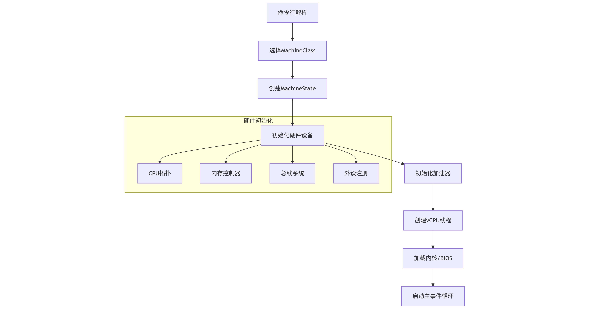

QEMU 创建虚拟机的核心流程可分为 6 个阶段，每个阶段都涉及特定的组件和操作：



## 命令行参数解析与初始化

入口函数：main()（位于 softmmu/main.c）
关键操作：

- 解析 -M 参数指定机器类型（如 virt）
- 初始化 QOM（QEMU 对象模型）类型系统
- 创建全局状态机 MachineState

代码流程：

```c
// softmmu/main.c
int main(int argc, char **argv) {
    qemu_init(argc, argv); // 初始化核心系统
    qemu_main_loop();      // 进入主事件循环
}

// system/vl.c
void qemu_init(int argc, char **argv) {
    qemu_opts_parse();          // 解析命令行参数
    machine_opts_dict = qdict_new(); // 创建机器参数字典
    keyval_parse_into(machine_opts_dict, optarg, "type"); // 解析-M 参数
    qemu_create_machine(machine_opts_dict); // 创建机器实例
}
```

## 机器类型选择与注册

核心组件：MachineClass（机器类描述）

关键操作：
- 通过 select_machine() 匹配用户指定的机器类型
- 从全局类型表 type_table 查找对应的 TypeImpl

```c
// hw/core/machine.c
static MachineClass *select_machine(QDict *qdict) {
    const char *optarg = qdict_get_try_str(qdict, "type");
    GSList *machines = object_class_get_list(TYPE_MACHINE, false);
    machine_class = find_machine(optarg, machines); // 匹配机器类型
    return machine_class;
}

// qom/object.c
GSList *object_class_get_list(const char *implements_type) {
    g_hash_table_foreach(type_table, object_class_foreach_tramp, &data);
    // 遍历所有已注册的机器类型
}
```

## 机器对象实例化

核心组件：MachineState（机器运行时状态）

关键操作：
- 通过 QOM 的 object_new_with_class() 实例化机器
- 初始化内存、CPU 拓扑等基础属性

```c
// system/vl.c
static void qemu_create_machine(QDict *qdict) {
    MachineClass *machine_class = select_machine(qdict);
    current_machine = MACHINE(object_new_with_class(OBJECT_CLASS(machine_class)));
    // 设置内存大小（示例）
    current_machine->ram_size = machine_class->default_ram_size;
}

// hw/core/machine.c
static void machine_initfn(Object *obj) {
    MachineState *ms = MACHINE(obj);
    ms->ram_size = mc->default_ram_size; // 默认内存大小
    ms->smp.cpus = mc->default_cpus;    // 默认 CPU 数量
}
```

## 硬件设备初始化

核心阶段：machine_run_board_init()

关键操作：

- 调用机器专属的 init() 方法（如 RISC-V virt 的 virt_machine_init()）
- 初始化 CPU、内存控制器、总线等核心组件

```c
// system/vl.c
void machine_run_board_init(MachineState *machine) {
    MachineClass *mc = MACHINE_GET_CLASS(machine);
    mc->init(machine); // 调用机器专属初始化函数
}

// hw/riscv/virt.c (RISC-V 示例)
static void virt_machine_init(MachineState *machine) {
    // 1. 初始化 CPU 拓扑
    for (int i = 0; i < smp_cpus; i++) {
        object_initialize_child(OBJECT(machine), "cpu", &s->soc[i], CPU_TYPE);
    }
    
    // 2. 初始化内存系统
    memory_region_init_ram(&s->ram, "riscv_virt_board.ram", ram_size);
    
    // 3. 初始化外设总线
    sysbus_init_mmio(SYS_BUS_DEVICE(&s->plic), &s->plic_mmio);
    
    // 4. 创建设备树 (FDT)
    create_fdt(s);
}
```

## 加速器与 CPU 初始化

核心组件：AccelState 和 CPUState

关键操作：
- 根据 -accel 参数选择 KVM/TCG 加速器
- 创建 vCPU 线程并绑定到物理 CPU

```c
// accel/accel-softmmu.c
void accel_init_machine(MachineState *ms) {
    AccelClass *ac = ACCEL_GET_CLASS(accel);
    ac->init_machine(ms); // 初始化加速器
}

// accel/kvm/kvm-all.c (KVM 示例)
static void kvm_init(MachineState *ms) {
    kvm_state->fd = open("/dev/kvm", O_RDWR); // 打开 KVM 设备
    kvm_state->vmfd = ioctl(kvm_state->fd, KVM_CREATE_VM); // 创建虚拟机
}

// cpu.c
void qemu_init_vcpu(CPUState *cpu) {
    cpus_accel->create_vcpu_thread(cpu); // 创建 vCPU 线程
}
```

## 启动虚拟机

最终阶段：qemu_main_loop()

关键操作：
 - 加载 BIOS 或内核镜像
 - 启动 vCPU 线程执行客户机代码
 - 进入主事件循环处理 I/O

```c
// system/vl.c
void qemu_main_loop(void) {
    // 1. 加载 BIOS 或内核
    if (machine->kernel_filename) {
        load_kernel(machine->kernel_filename);
    }
    
    // 2. 启动所有 vCPU
    CPU_FOREACH(cpu) {
        qemu_cpu_kick(cpu);
    }
    
    // 3. 主事件循环
    while (!main_loop_should_exit()) {
        main_loop_wait(false);
    }
}

```

一个简化的 RISC-V virt Machine 代码示例：

```c
/* hw/riscv/virt.c - RISC-V virt 机器实现 */

#define TYPE_RISCV_VIRT_MACHINE "riscv-virt-machine"

typedef struct RISCVVirtState {
    MachineState parent; // 继承 MachineState

    /* 硬件组件 */
    RISCVHartArrayState soc[RISCV_SOCKETS_MAX]; // CPU 集群
    MemoryRegion ram;                          // 内存区域
    DeviceState *plic;                         // 中断控制器
    DeviceState *uart;                         // 串口设备
} RISCVVirtState;

/* 机器类初始化 */
static void virt_machine_class_init(ObjectClass *oc, void *data) {
    MachineClass *mc = MACHINE_CLASS(oc);
    
    mc->desc = "RISC-V VirtIO Board";
    mc->init = virt_machine_init;          // 绑定初始化函数
    mc->max_cpus = 8;                      // 最大 CPU 数
    mc->default_ram_size = 256 * MiB;       // 默认内存大小
    mc->default_cpu_type = RISCV_CPU_TYPE_NAME("rv64");
}

/* 机器实例初始化 */
static void virt_machine_init(MachineState *machine) {
    RISCVVirtState *s = RISCV_VIRT_MACHINE(machine);
    const MemMapEntry *memmap = virt_memmap;
    
    /* === 1. 初始化 CPU 拓扑 === */
    for (int i = 0; i < machine->smp.cpus; i++) {
        char *name = g_strdup_printf("cpu%d", i);
        object_initialize_child(OBJECT(machine), name, &s->soc[i],
                               TYPE_RISCV_HART_ARRAY);
        qdev_realize(DEVICE(&s->soc[i]), NULL, &error_fatal);
    }
    
    /* === 2. 初始化内存系统 === */
    memory_region_init_ram(&s->ram, OBJECT(machine), "riscv_virt.ram",
                           machine->ram_size, &error_fatal);
    memory_region_add_subregion(get_system_memory(), memmap[VIRT_DRAM].base, &s->ram);
    
    /* === 3. 初始化中断控制器 === */
    s->plic = qdev_new(TYPE_RISCV_PLIC);
    qdev_prop_set_uint32(s->plic, "num-sources", VIRT_PLIC_NUM_SOURCES);
    sysbus_realize_and_unref(SYS_BUS_DEVICE(s->plic), &error_fatal);
    sysbus_mmio_map(SYS_BUS_DEVICE(s->plic), 0, memmap[VIRT_PLIC].base);
    
    /* === 4. 初始化串口 === */
    s->uart = qdev_new(TYPE_SERIAL_MM);
    qdev_prop_set_chr(s->uart, "chardev", serial_hd(0));
    sysbus_realize_and_unref(SYS_BUS_DEVICE(s->uart), &error_fatal);
    sysbus_mmio_map(SYS_BUS_DEVICE(s->uart), 0, memmap[VIRT_UART0].base);
    
    /* === 5. 创建设备树 === */
    s->fdt = create_device_tree(&s->fdt_size);
    create_fdt(s); // 生成设备树二进制
    
    /* === 6. 加载固件和内核 === */
    if (machine->firmware) {
        riscv_load_firmware(machine->firmware, memmap[VIRT_DRAM].base);
    }
    if (machine->kernel_filename) {
        riscv_load_kernel(machine->kernel_filename);
    }
}

/* === QOM 类型注册 === */
static const TypeInfo virt_machine_typeinfo = {
    .name = TYPE_RISCV_VIRT_MACHINE,
    .parent = TYPE_MACHINE,
    .class_init = virt_machine_class_init,
    .instance_size = sizeof(RISCVVirtState),
};

static void virt_machine_register_types(void) {
    type_register_static(&virt_machine_typeinfo);
}
type_init(virt_machine_register_types);
```