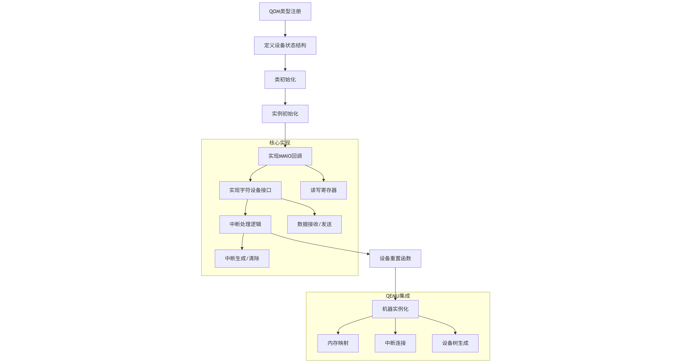

我们以 PL011 串口为例，讲解如何建模一个外设。

L011 串口在 QEMU 中的建模完整展示了硬件外设模拟的核心流程：

- 类型系统集成：通过 QOM 实现设备类的继承体系
- 状态精确建模：寄存器、FIFO、中断状态的全周期管理
- 硬件接口实现：MMIO 回调处理 CPU 访问，字符后端对接宿主 I/O
- 中断系统集成：与平台中断控制器 (PLIC) 协同工作
- 设备生命周期：实现重置、迁移、销毁等完整生命周期



## 设备类型定义

核心机制：QEMU Object Model (QOM)

关键操作：

 - 定义 TypeInfo 结构体描述设备类型
 - 实现类初始化 (class_init) 和实例初始化 (instance_init)
 - 注册到全局类型系统

```c
 // hw/char/pl011.c
static const TypeInfo pl011_type_info = {
    .name = TYPE_PL011,
    .parent = TYPE_SYS_BUS_DEVICE,
    .instance_size = sizeof(PL011State),
    .class_init = pl011_class_init,
    .instance_init = pl011_instance_init,
};

static void pl011_register_types(void) {
    type_register_static(&pl011_type_info);
}
type_init(pl011_register_types);
```


## 设备状态结构设计

核心组件：PL011State

关键字段：

 - 寄存器状态 (lcr, imsc, 等)
 - FIFO 缓冲区
 - 中断信号线
 - 字符后端 (CharBackend)

```c
typedef struct PL011State {
    SysBusDevice parent_obj;
    
    /* 寄存器状态 */
    uint32_t lcr;       // 线路控制寄存器
    uint32_t imsc;      // 中断屏蔽寄存器
    uint32_t flags;     // 状态标志位
    
    /* FIFO 缓冲区 */
    uint8_t read_fifo[PL011_FIFO_DEPTH];
    uint32_t read_pos;
    uint32_t read_count;
    
    /* 中断系统 */
    qemu_irq irq;       // 中断信号线
    
    /* 字符设备后端 */
    CharBackend chr;    // 连接宿主终端或文件
} PL011State;

```

## 设备类初始化

核心任务：
- 设置设备属性 (properties)
- 绑定 realize 和 reset 方法
- 定义设备迁移支持

```c
static void pl011_class_init(ObjectClass *klass, void *data) {
    DeviceClass *dc = DEVICE_CLASS(klass);
    
    dc->realize = pl011_realize;
    dc->reset = pl011_reset;
    dc->vmsd = &vmstate_pl011;
    
    device_class_set_props(dc, pl011_properties);
}

static Property pl011_properties[] = {
    DEFINE_PROP_CHR("chardev", PL011State, chr),
    DEFINE_PROP_UINT32("clock", PL011State, clock, 0),
    DEFINE_PROP_END_OF_LIST(),
};
```

## 设备实例化与硬件连接

核心操作：

- 初始化内存区域 (MemoryRegion)
- 注册 MMIO 回调函数
- 连接中断信号
- 绑定字符设备后端

```c
static void pl011_realize(DeviceState *dev, Error **errp) {
    PL011State *s = PL011(dev);
    SysBusDevice *sbd = SYS_BUS_DEVICE(dev);
    
    /* 1. 初始化内存区域 */
    memory_region_init_io(&s->iomem, OBJECT(s), &pl011_ops, s, "pl011", 0x1000);
    sysbus_init_mmio(sbd, &s->iomem);
    
    /* 2. 初始化中断 */
    sysbus_init_irq(sbd, &s->irq);
    
    /* 3. 连接字符设备 */
    qemu_chr_fe_set_handlers(&s->chr, pl011_can_receive, pl011_receive,
                             NULL, NULL, s, NULL, true);
}

```

## 实现设备功能逻辑

核心组件：

- MMIO 读写回调
- 中断生成逻辑
- FIFO 管理
- 字符设备通信

```c
/* MMIO 写操作 */
static void pl011_write(void *opaque, hwaddr offset, uint64_t value, unsigned size) {
    PL011State *s = opaque;
    
    switch (offset) {
    case PL011_DR:  // 数据寄存器
        if (s->lcr & LCR_FEN) {
            fifo_push(s, value);  // FIFO 模式
        } else {
            qemu_chr_fe_write(&s->chr, (uint8_t*)&value, 1); // 直接发送
        }
        break;
    case PL011_IMSC: // 中断屏蔽
        s->imsc = value;
        pl011_update(s);  // 更新中断状态
        break;
    }
}

/* 字符设备接收回调 */
static void pl011_receive(void *opaque, const uint8_t *buf, int size) {
    PL011State *s = opaque;
    fifo_push(s, *buf);  // 数据放入接收 FIFO
    s->int_status |= INT_RX;  // 设置接收中断
    qemu_set_irq(s->irq, 1);  // 触发中断
}
```

## 中断处理与状态更新

核心逻辑：

- 根据寄存器状态生成中断
- 实现中断清除机制
- FIFO 阈值触发

```c
static void pl011_update(PL011State *s) {
    uint32_t int_level = 0;
    
    /* 检查接收中断 */
    if ((s->imsc & INT_RX) && (s->read_count > 0)) {
        int_level |= INT_RX;
    }
    
    /* 检查发送中断 */
    if ((s->imsc & INT_TX) && (s->xmit_count < PL011_FIFO_DEPTH)) {
        int_level |= INT_TX;
    }
    
    /* 更新中断线 */
    qemu_set_irq(s->irq, int_level ? 1 : 0);
}
```

一个简单 PL011 设备建模的代码示例：

```c
/* hw/char/pl011.c - PL011 UART 完整实现 */

#define TYPE_PL011 "pl011"
#define PL011(obj) OBJECT_CHECK(PL011State, (obj), TYPE_PL011)

/* 寄存器偏移定义 */
enum {
    PL011_DR    = 0x00, // 数据寄存器
    PL011_FR    = 0x18, // 标志寄存器
    PL011_ILPR  = 0x20, // 低功耗寄存器
    PL011_IBRD  = 0x24, // 整数波特率
    PL011_FBRD  = 0x28, // 小数波特率
    PL011_LCRH  = 0x2C, // 线路控制
    PL011_CR    = 0x30, // 控制寄存器
    PL011_IMSC  = 0x38, // 中断屏蔽
};

/* 设备状态结构 */
typedef struct PL011State {
    SysBusDevice parent_obj;
    MemoryRegion iomem;
    CharBackend chr;
    qemu_irq irq;
    
    /* 寄存器状态 */
    uint32_t readbuff;
    uint32_t flags;
    uint32_t lcr;
    uint32_t cr;
    uint32_t imsc;
    uint32_t int_level;
    
    /* FIFO 状态 */
    uint8_t read_fifo[PL011_FIFO_DEPTH];
    uint32_t read_pos;
    uint32_t read_count;
    uint32_t read_trigger;
} PL011State;

/* MMIO 操作回调 */
static const MemoryRegionOps pl011_ops = {
    .read = pl011_read,
    .write = pl011_write,
    .endianness = DEVICE_NATIVE_ENDIAN,
    .impl.min_access_size = 4,
    .impl.max_access_size = 4,
};

/* 读操作实现 */
static uint64_t pl011_read(void *opaque, hwaddr offset, unsigned size) {
    PL011State *s = opaque;
    uint32_t ret = 0;
    
    switch (offset) {
    case PL011_DR:
        if (s->read_count > 0) {
            ret = s->read_fifo[s->read_pos];
            s->read_pos = (s->read_pos + 1) % PL011_FIFO_DEPTH;
            s->read_count--;
            pl011_update(s); // 更新中断状态
        }
        break;
    case PL011_FR:
        ret = s->flags;
        break;
    case PL011_IMSC:
        ret = s->imsc;
        break;
    }
    return ret;
}

/* 写操作实现 */
static void pl011_write(void *opaque, hwaddr offset, uint64_t value, unsigned size) {
    PL011State *s = opaque;
    
    switch (offset) {
    case PL011_DR:
        qemu_chr_fe_write(&s->chr, (uint8_t*)&value, 1);
        break;
    case PL011_LCRH:
        s->lcr = value;
        break;
    case PL011_IMSC:
        s->imsc = value;
        pl011_update(s);
        break;
    }
}

/* 字符设备接收回调 */
static void pl011_receive(void *opaque, const uint8_t *buf, int size) {
    PL011State *s = opaque;
    
    if (s->read_count < PL011_FIFO_DEPTH) {
        int slot = (s->read_pos + s->read_count) % PL011_FIFO_DEPTH;
        s->read_fifo[slot] = *buf;
        s->read_count++;
        
        if (s->read_count >= s->read_trigger) {
            s->int_level |= INT_RX;
            qemu_set_irq(s->irq, 1);
        }
    }
}

/* 中断状态更新 */
static void pl011_update(PL011State *s) {
    uint32_t int_level = 0;
    
    // 接收中断 (RX)
    if ((s->imsc & INT_RX) && (s->read_count > 0)) {
        int_level |= INT_RX;
    }
    
    // 发送中断 (TX)
    if ((s->imsc & INT_TX) && (s->xmit_count < PL011_FIFO_DEPTH)) {
        int_level |= INT_TX;
    }
    
    qemu_set_irq(s->irq, int_level ? 1 : 0);
}

/* 设备重置 */
static void pl011_reset(DeviceState *dev) {
    PL011State *s = PL011(dev);
    
    s->lcr = 0;
    s->cr = 0x300;
    s->imsc = 0;
    s->read_count = 0;
    s->read_pos = 0;
    s->int_level = 0;
    qemu_set_irq(s->irq, 0);
}

/* 设备初始化 */
static void pl011_realize(DeviceState *dev, Error **errp) {
    PL011State *s = PL011(dev);
    SysBusDevice *sbd = SYS_BUS_DEVICE(dev);
    
    memory_region_init_io(&s->iomem, OBJECT(s), &pl011_ops, s, "pl011", 0x1000);
    sysbus_init_mmio(sbd, &s->iomem);
    sysbus_init_irq(sbd, &s->irq);
    
    qemu_chr_fe_set_handlers(&s->chr, pl011_can_receive, pl011_receive,
                             NULL, NULL, s, NULL, true);
}

/* 类型注册 */
static const TypeInfo pl011_info = {
    .name = TYPE_PL011,
    .parent = TYPE_SYS_BUS_DEVICE,
    .instance_size = sizeof(PL011State),
    .class_init = pl011_class_init,
};

static void pl011_register_types(void) {
    type_register_static(&pl011_info);
}
type_init(pl011_register_types)
```

在 RISC-V virt 机器中实例化 PL011:

```c
/* hw/riscv/virt.c - 机器初始化 */

static void virt_machine_init(MachineState *machine) {
    // ...
    
    /* 创建 PL011 串口 */
    DeviceState *dev = qdev_new(TYPE_PL011);
    qdev_prop_set_chr(dev, "chardev", serial_hd(0));
    
    sysbus_realize_and_unref(SYS_BUS_DEVICE(dev), &error_fatal);
    sysbus_mmio_map(SYS_BUS_DEVICE(dev), 0, 0x10000000); // 映射到 0x10000000
    sysbus_connect_irq(SYS_BUS_DEVICE(dev), 0, plic_irq[UART0_IRQ]); // 连接中断
    
    // 设备树添加节点
    qemu_fdt_add_subnode(fdt, "/soc/serial");
    qemu_fdt_setprop_string(fdt, "/soc/serial", "compatible", "arm,pl011");
    qemu_fdt_setprop_cells(fdt, "/soc/serial", "reg", 0x10000000, 0x1000);
    qemu_fdt_setprop_cells(fdt, "/soc/serial", "interrupts", UART0_IRQ);
}
```

## 关键实现要点

寄存器精确建模：

- 实现所有 32 个寄存器的精确行为
- 处理特殊位（如 FIFO 使能位、中断屏蔽位）
- 支持波特率计算（IBRD/FBRD）


FIFO 状态机：

```
cstatic void fifo_push(PL011State *s, uint32_t value) {
    if (s->read_count < PL011_FIFO_DEPTH) {
        uint32_t slot = (s->read_pos + s->read_count) % PL011_FIFO_DEPTH;
        s->read_fifo[slot] = value;
        s->read_count++;
        
        // 触发中断条件
        if (s->read_count >= s->read_trigger) {
            s->int_level |= INT_RX;
            qemu_set_irq(s->irq, 1);
        }
    }
}

```

时钟域处理：

- 实现 pl011_clock_update 回调
- 处理波特率变化事件
- 支持动态时钟调整


迁移支持：

```c
cstatic const VMStateDescription vmstate_pl011 = {
    .name = "pl011",
    .version_id = 2,
    .fields = (VMStateField[]) {
        VMSTATE_UINT32(lcr, PL011State),
        VMSTATE_UINT32_ARRAY(read_fifo, PL011State, PL011_FIFO_DEPTH),
        VMSTATE_UINT32(read_pos, PL011State),
        VMSTATE_UINT32(read_count, PL011State),
        VMSTATE_END_OF_LIST()
    }
};
```

性能优化：

- 使用位操作代替除法计算波特率
- FIFO 操作用掩码替代取模运算
- 中断状态缓存减少计算次数

这种建模方式使 PL011 在 QEMU 中能精确模拟真实硬件行为，支持从裸机程序到 Linux 内核的全栈开发。