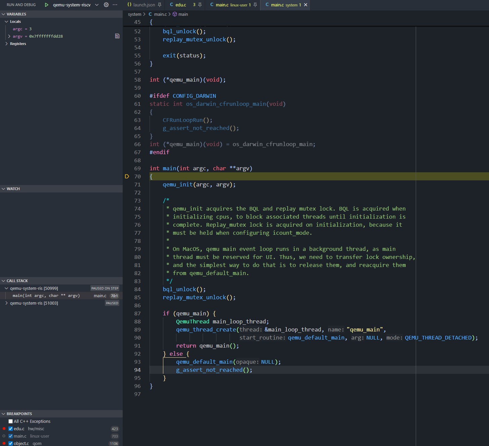

在学习阶段，查看和分析 QEMU 的源码是必不可少的一个环节。但是通过 GDB 去调试会比较“原始”(很抱歉笔者比较懒)。因此就需要通过 vscode 或者 IDE 进行调试。

值得庆幸的是，调试 QEMU 源码并不需要类似于调试内核一样，需要先启动后通过 gdb attach，QEMU 本身是能够直接在本地进行执行的，所以只需要配置好 vscode 的插件配置。

!!! note "额外提示"

    目前主流还是通过 vscode 进行图形化地调试各种大型项目，至于 CLion 这种 IDE 笔者认为仅需要配置要调试参数即可(因为 CLion 可以自行根据 meson 和 CMakeLists.txt 进行捕获可执行文件)

在 vscode 上，调试需要的插件为[C/C++](https://marketplace.visualstudio.com/items?itemName=ms-vscode.cpptools)，至于其他插件，请根据读者自身的喜好进行下载。

下载就绪后，读者需要编译出二进制文件 (qemu-[arch]/qemu-system-[arch])，然后根据如下配置进行修改 (.vscode/launch.json)

``` json
{
  // Use IntelliSense to learn about possible attributes.
  // Hover to view descriptions of existing attributes.
  // For more information, visit: https://go.microsoft.com/fwlink/?linkid=830387
  "version": "0.2.0",
  "configurations": [
    {
      "name": "qemu-system-riscv",
      "type": "cppdbg",
      "request": "launch",
      "program": "${workspaceFolder}/build/qemu-system-riscv64",
      "args": [
        "-device", "edu,id=edu1"
      ],
      "stopAtEntry": true,
      "cwd": "${fileDirname}",
      "environment": [],
      "externalConsole": false,
      "MIMode": "gdb",
      "setupCommands": [
          {
              "description": "Enable pretty-printing for gdb",
              "text": "-enable-pretty-printing",
              "ignoreFailures": true
          },
          {
              "description": "Set Disassembly Flavor to Intel",
              "text": "-gdb-set disassembly-flavor intel",
              "ignoreFailures": true
          }
      ]
    },
  ]
}
```

读者只需要修改`program`在读者本机的确切地址即可，至于`name`则可以随自身喜好进行设置。然后，就可以直接开始调试 (`stopAtEntry=true`会使得调试器停顿在入口处)。


