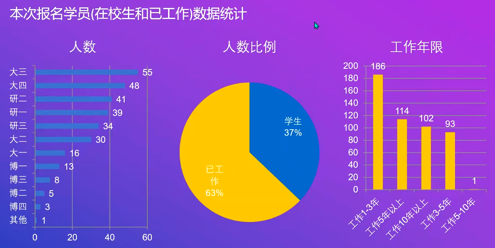
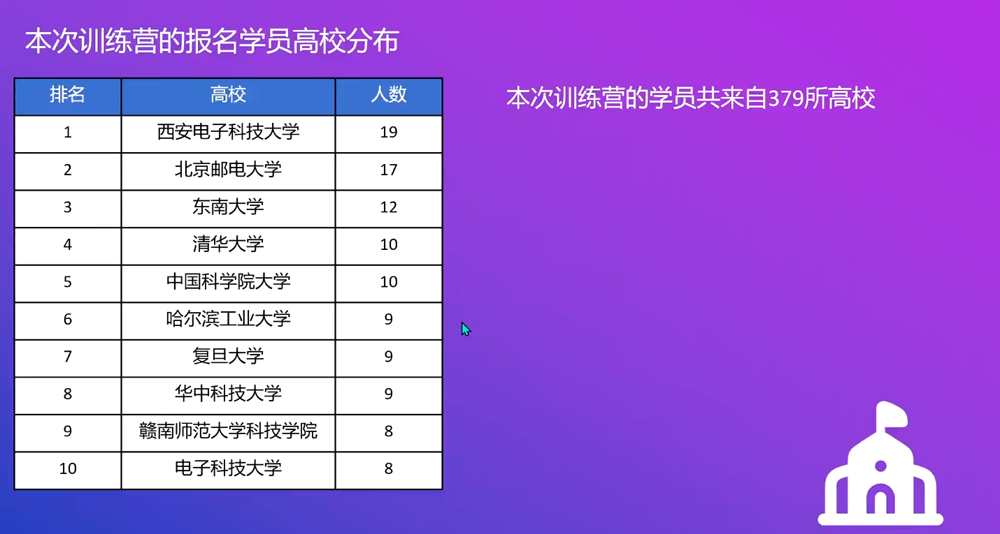

# 欢迎来到 QEMU 训练营（2025）

!!! tip "训练营介绍"

    QEMU 训练营（2025）是由格维开源社区（GTOC）主办， OpenCamp 训练营协办的公益性基础技术训练营。本训练营致力于帮助开发者了解虚拟化核心技术，系统性地掌握 QEMU 的硬件建模方法与虚拟化工具的实际应用。

    通过由浅入深的课程设计与动手实践，学员将学习 QEMU 的基本架构、设备模拟原理、外设建模技术以及系统仿真环境的搭建与调试。我们不仅注重技术能力的培养，更希望激发学员对底层基础软件的兴趣，深化对计算机体系结构、操作系统与硬件协同工作机制的理解。

    无论你是计算机相关专业的学生，还是希望拓展系统级开发能力的工程师，2025 QEMU 训练营都将为你打开通往系统虚拟化与开源世界的大门。

[☞ 线上报名通道 ☄](https://opencamp.cn/qemu/camp/2025/register?code=cMJyhG4owbdmU)

!!! note "报名统计"
    截至 2025 年 10 月 12 日晚 8 点开营仪式之前，共有 858 名学员报名，来自 379 所高校、231 家企业和 80 个城市。

    

    学员中 63% 为已工作人员，37% 为在校生。高校（排名不分先后）中以西安电子科技大学、北京邮电大学、东南大学、清华大学、复旦大学、华中科技大学等多所高校的学员最多。

    

